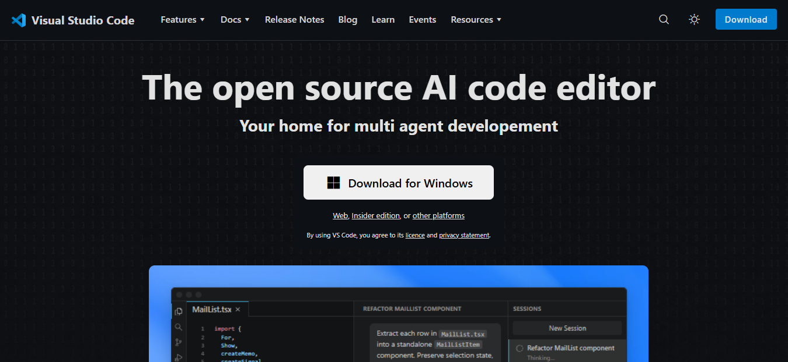
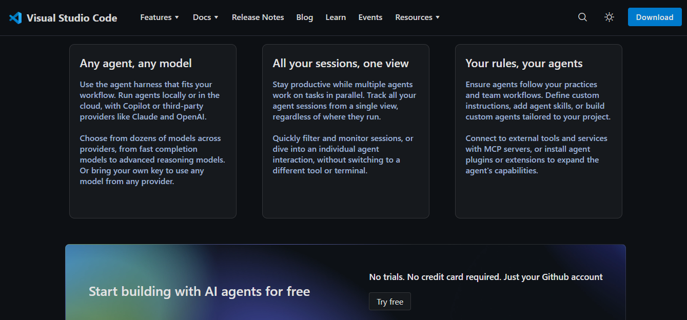
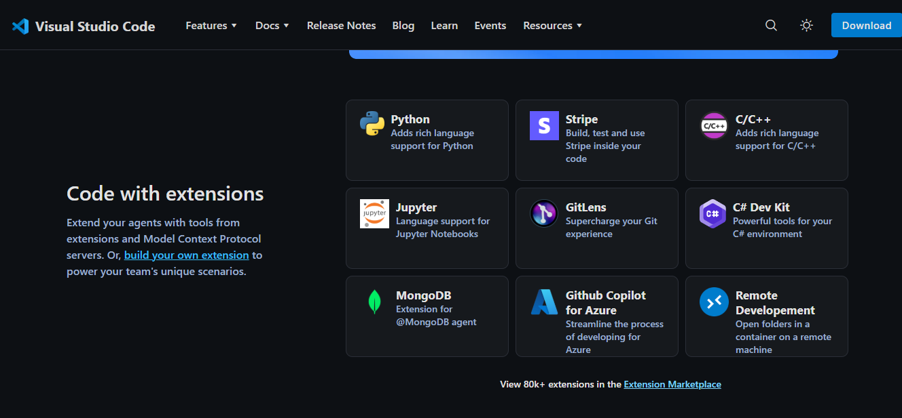
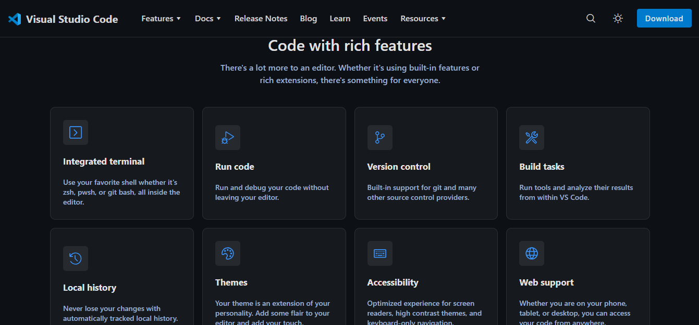

# Visual Studio Code Clone

A clone for the [official VS Code website](https://code.visualstudio.com/)

Features
- An exact copy of the hero page
- But without the option of switching between themes (dark and light)

This was an idea of my elder sister when she built projects with HTML CSS JS. But now she has moved on from web developement so she donated (quote unqoute) her idea to me.

\
\
\
